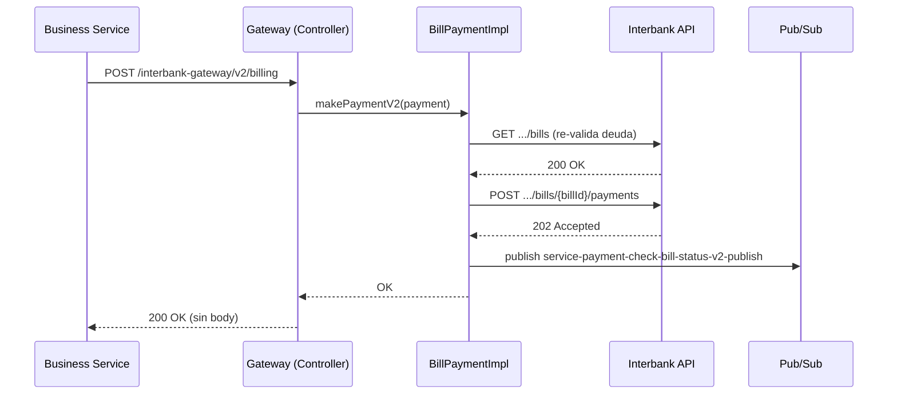
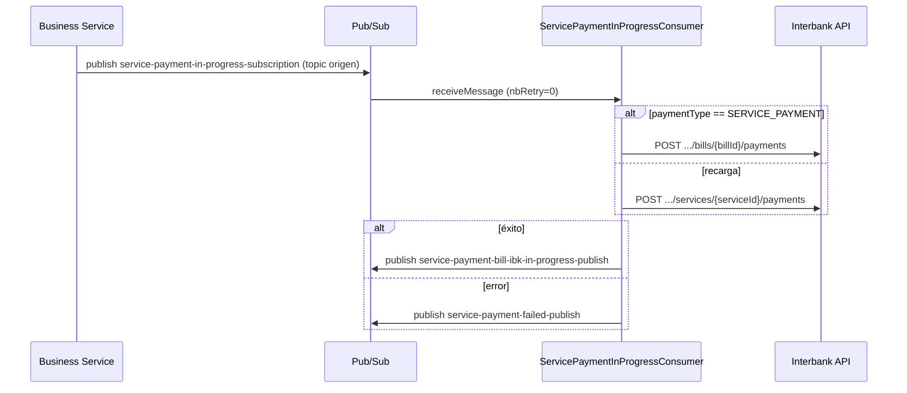
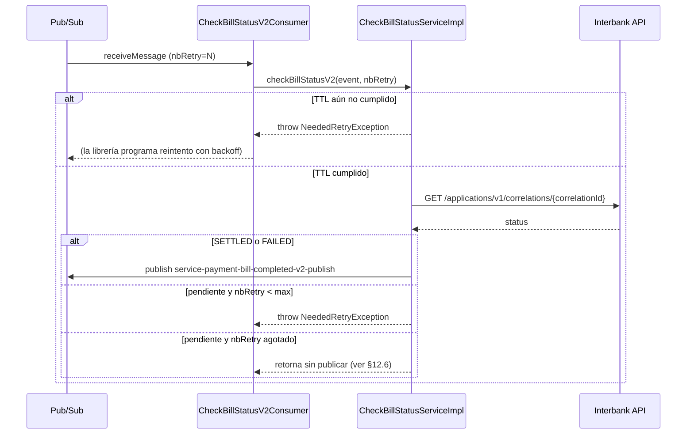

# Documentación Técnica — gwpagoservicios

> Documento generado a partir de una revisión completa del código fuente (`src/main/java`), la configuración por ambiente (`application-*.properties`), los contratos de eventos (`src/main/resources/swagger/event/contracts`) y la librería interna `tunki-pubsub` (inspeccionada en el `.jar` del repositorio Maven local) para describir con precisión su comportamiento en tiempo de ejecución.
>
> Complementa a [README.md](README.md).

---

## 1. Qué es este servicio

`gwpagoservicios` es un microservicio Spring Boot (Java 21 / Spring Boot 3.2.15) que actúa como **anticorrupción / integración** entre el ecosistema interno "Tunki" y la **API de Open Banking de Interbank (IBK)**. Expone:

- Un **API REST** hacia el servicio de negocio interno (Business Service, en adelante **BS**) para el flujo síncrono de pago de servicios.
- **Consumidores y publicadores de Google Cloud Pub/Sub** para los flujos asíncronos (pago disparado por cola, verificación de estado del pago).
- Un **cliente Retrofit/OkHttp** hacia los endpoints REST de IBK (OAuth2, pago de recibos, recargas, transferencias, consulta de estado).

Según el propio README del proyecto, el flujo de extremo a extremo es:

```
UX (frontend)  →  BS (us-bs-service / bs-service)  →  GW (gwpagoservicios, este repo)  →  EXT (Interbank OpenBanking API)
```

Confirmado en este workspace: el proyecto hermano [`bs-service`](../bs-service) contiene `V2GatewayInterbankRestClient` (cliente REST que llama a este gateway) y comparte en sus `application-*.properties` los mismos nombres de tópicos/suscripciones de Pub/Sub descritos en la sección 7, es decir, `bs-service` es el productor/consumidor al otro lado de casi todas las colas de este gateway.

---

## 2. Stack tecnológico

| Componente | Detalle |
|---|---|
| Lenguaje / runtime | Java 21 |
| Framework | Spring Boot 3.2.5 (`spring-boot-starter-web`, `actuator`, `validation`, `thymeleaf` solo para la página `/`) |
| Cliente HTTP saliente hacia IBK | Retrofit 2.9.0 + OkHttp 4.12.0 (no usa `RestTemplate`/`WebClient` de Spring) |
| Mensajería | Google Cloud Pub/Sub, envuelto por la librería interna `pe.indigital.tunki.pubsub:tunki-pubsub:1.8.1` |
| Librería interna compartida | `pe.indigital.tunki.common:tunki-common:1.5.13` (interceptor de logging de Retrofit, claves MDC `LoggingHeader`, clases base `Header`/`Error` de eventos) |
| Caché / lock distribuido | Redis vía Redisson 3.17.0 (solo lo usa la librería `tunki-pubsub` para deduplicación de mensajes) |
| Serialización | Jackson (`ObjectMapper` central, `FAIL_ON_UNKNOWN_PROPERTIES=false`, soporte `java.time.*`) |
| Generación de modelos de evento | plugin Maven `jsonschema2pojo`, genera clases Java desde `src/main/resources/swagger/event/contracts/*.json` en tiempo de build |
| Logging | Logback + `logstash-logback-encoder`, más librería propia `framework-logging` (Logbook para HTTP entrante, métricas Micrometer) |
| Base de datos | `mysql-connector-java` está declarado en el `pom.xml`, pero **no se encontró ningún `@Entity`, `@Repository`, `JpaRepository` ni `spring.datasource.*`** en el código propio del servicio — parece un dependency heredado de un arquetipo común, sin uso real aquí. El `docker-compose.yml` local levanta MySQL y Redis, pero solo Redis está efectivamente cableado en el código. |
| Empaquetado / despliegue | Docker (`Dockerfile`, `newDockerfile`), Azure DevOps (`pipeline-building.yml`, `pipeline-integration.yml`, `azure-templates/`), Kubernetes (namespace `tunki`, según README) |

---

## 3. Arquitectura de capas (puertos y adaptadores)

El paquete raíz es `pe.financiera.gw.pagoservicios`. La estructura sigue un estilo hexagonal (ports & adapters), aunque con una convención de nombres propia que conviene aclarar primero:

- **`business.output`** → interfaces que el dominio **ofrece hacia afuera** (las implementan las clases de servicio del dominio; las consumen los controladores REST y los consumidores de cola). Son el **punto de entrada** a la lógica de negocio.
- **`business.input`** → interfaces que el dominio **necesita como dependencia** (las consume el dominio; las implementan los adaptadores salientes hacia IBK y hacia las colas). Son **puertos de salida** en la terminología hexagonal clásica.

```
┌───────────────────────────────────────────────────────────────────────────┐
│                              ENTRADA (driving)                             │
│  interbank/controller/*            queue/service/payment/*Consumer*        │
│  (REST síncrono, desde BS)         (Pub/Sub asíncrono, desde BS o self)    │
└───────────────────────────────┬───────────────────────────────────────────┘
                                 │  implementa/usa
                                 ▼
                 business/output/*  (BillPaymentService, CheckBillStatusService)
                                 │
                                 ▼
                 business/BillPaymentImpl, CheckBillStatusServiceImpl   ◄── DOMINIO
                                 │  usa
                                 ▼
                 business/input/*  (BillPaymentPort, TransactionPort,
                                    SecurityRepositoryPort, PaymentFailedPublisher)
                                 │  implementa
                                 ▼
┌───────────────────────────────┴───────────────────────────────────────────┐
│                              SALIDA (driven)                               │
│  interbank/services/proxy/{billing,security,transaction}/*Adapter          │
│  (REST saliente hacia IBK, vía Retrofit)                                   │
│                                                                             │
│  queue/service/payment/*PublisherAdapter, MessagePublisher (por Qualifier) │
│  (Pub/Sub saliente hacia BS o hacia el propio gateway)                     │
└───────────────────────────────────────────────────────────────────────────┘
```

Paquetes principales:

| Paquete | Responsabilidad |
|---|---|
| `interbank.controller` | Controladores REST expuestos por el gateway (entrada síncrona) |
| `interbank.business` | Dominio: implementaciones (`BillPaymentImpl`, `CheckBillStatusServiceImpl`), puertos `input`/`output`, modelos `domain` |
| `interbank.services.proxy.billing` | Adaptador REST hacia `/billpayments/v1/...` de IBK |
| `interbank.services.proxy.security` | Adaptador REST hacia `/security/v1/oauth/token` de IBK (autenticación) |
| `interbank.services.proxy.transaction` | Adaptador REST hacia `/trx/v1/...` y `/applications/v1/correlations/...` de IBK |
| `queue.service.payment` | Consumidores y publicadores de Pub/Sub (entrada/salida asíncrona) |
| `config.pubsub` | Definición de *beans* de Subscriber/Publisher de GCP Pub/Sub |
| `config.interbank` | Credenciales y parámetros de acceso a IBK (`OpenBankingAccessParameters`) |
| `config.retrofit` | Cliente HTTP genérico (Retrofit + OkHttp) reutilizado por los 3 adaptadores de IBK |
| `config.redis` | Cliente Redisson (usado por la librería de colas para deduplicación) |
| `util.authorization` | Caché/renovación del token OAuth2 de IBK (`InterbankAuthorizationManager`, `JWTParser`) |
| `util.exception` | Excepciones de negocio (`RestClientException`, `BadRequestException`) y su traducción a HTTP |

---

## 4. Endpoints REST expuestos por el Gateway (hacia BS)

Definidos en [`ServicesPaymentController`](src/main/java/pe/indigital/tunki/gateway/interbank/controller/ServicesPaymentController.java), bajo el prefijo `/interbank-gateway`:

| Método | Path | Handler | Descripción |
|---|---|---|---|
| `GET` | `/interbank-gateway/recipient/{recipientId}/service/{serviceId}/bills?clientId=...` | `getBills` → `billPaymentService.getBills(...)` | **PRE_CONFIRMATION**: consulta en IBK la(s) factura(s)/deuda del cliente para un recaudador+servicio, antes de que el usuario confirme el pago. |
| `POST` | `/interbank-gateway/v2/billing` | `makeBillPaymentV2` → `billPaymentService.makePaymentV2(payment)` | **CONFIRMATION**: ejecuta el pago del servicio en IBK y dispara la verificación asíncrona de estado. |
| `GET` | `/` | `HomeController.homePage` | Página HTML simple (Thymeleaf) con `appName`, `environment` e `imageTag` — sirve como *landing*/healthcheck visual, no es parte del API de negocio. |

**Importante:** los métodos `makePayment` (v1), `makeDirectPayment` y `getRecipients` **sí existen** en `BillPaymentService`/`BillPaymentPort`, pero **no están expuestos por ningún controlador**. Solo se invocan internamente desde el consumidor de cola `ServicePaymentInProgressConsumer` (ver §7.4.1). Es decir, el pago de servicio "directo" (recargas) y el pago disparado por cola **no tienen equivalente síncrono vía REST** — solo el flujo `v2/billing` es síncrono.

La numeración de logs (`GW_SERVICE_PAY_..._STEP_N.M.K`) documentada en el propio [README.md](README.md#sistema-de-logs-por-steps--service-pay-gw) es el trazador oficial de este flujo; se resume en la sección 10.

---

## 5. Comunicación con Interbank (Open Banking API)

### 5.1 Cliente HTTP

Todos los adaptadores hacia IBK reutilizan el mismo *builder* genérico [`RetrofitRestClient`](src/main/java/pe/indigital/tunki/gateway/config/retrofit/RetrofitRestClient.java), instanciado una vez por interfaz Retrofit (`TokenRestClient`, `BillPaymentRestClient`, `TransactionRestClient`) desde su propia clase `*RestClientConfig`. El `OkHttpClient` subyacente ([`RestClientConfig`](src/main/java/pe/indigital/tunki/gateway/config/retrofit/RestClientConfig.java)) se configura así:

- **`baseUrl`**: `services-api.interbank.api.baseUrl` (env var `OPENBANKING_URL`). Según ambiente: `https://apidev.digital.interbank.pe` (dev, según README) / `https://apiqa.digital.interbank.pe` (qa) / equivalente en prod.
- **`Dispatcher.maxRequests`**: `services-api.interbank.api.maxRequest` (100 por defecto) — máximo de requests concurrentes del pool OkHttp.
- **`connectTimeout` / `readTimeout` / `writeTimeout`**: configurables, pero interpretados en **segundos** (`TimeUnit.SECONDS`) y con valor `100` en todos los ambientes (dev/qa/uat/prod) — ver observación §12.2.
- **2 interceptores encadenados**: uno propio ([`LoggingInterceptor`](src/main/java/pe/indigital/tunki/gateway/config/retrofit/LoggingInterceptor.java), loguea URL/método/body de cada request y el body completo de cada response) y otro de la librería compartida `pe.indigital.tunki.common.retrofit.LoggingInterceptor`.
- **`hostnameVerifier((s, sslSession) -> true)`**: acepta cualquier hostname en el certificado TLS del servidor remoto — ver observación §12.1.

### 5.2 Autenticación — OAuth2 Client Credentials

```
POST {baseUrl}/security/v1/oauth/token
Authorization: Basic base64(applicationId:password)
Content-Type: application/x-www-form-urlencoded

grant_type=client_credentials
```

- Implementado en [`TokenRestClient`](src/main/java/pe/indigital/tunki/gateway/interbank/services/proxy/security/TokenRestClient.java) → [`SecurityRestClientAdapter`](src/main/java/pe/indigital/tunki/gateway/interbank/services/proxy/security/SecurityRestClientAdapter.java).
- El header `Authorization` Basic se arma en [`OpenBankingAccessParameters.getBasicAuth()`](src/main/java/pe/indigital/tunki/gateway/config/interbank/OpenBankingAccessParameters.java) a partir de `services-api.interbank.access.applicationId` y `...password` (env vars `OPENBANKING_APPLICATION_ID` / `OPENBANKING_PASSWORD`).
- Respuesta (`TokenOkResponse`): `access_token`, `token_type`, `expires_in`, `scope`, `jti`.

**Caché y renovación** — [`InterbankAuthorizationManager`](src/main/java/pe/indigital/tunki/gateway/util/authorization/InterbankAuthorizationManager.java):

1. Es un `@Component` *singleton* de Spring que guarda el token **en memoria** (campo de instancia), no en Redis ni BD → **cada pod/instancia del gateway gestiona su propio token de forma independiente**.
2. Antes de cada llamada a IBK, `getOpenBankingAccess()` invoca `processAccess()` (método `synchronized`, para evitar que dos hilos del mismo pod rieguen la renovación al mismo tiempo):
   - Si no hay token cacheado → lo pide (`renewCredentials()`).
   - Si hay token, decodifica el JWT con [`JWTParser`](src/main/java/pe/indigital/tunki/gateway/util/authorization/JWTParser.java) (split por `.`, Base64-decode del *payload*, lee el claim `exp`). **No valida la firma del JWT**, solo lee la expiración — razonable porque el JWT llega directo de IBK por TLS, no de una fuente no confiable.
   - Si `exp` ya pasó (o no se pudo parsear) → renueva. Si sigue vigente → reutiliza el mismo token.
3. No hay *scheduler* de refresco en segundo plano: la renovación ocurre "perezosamente" en el hilo de la request que descubre que el token venció, agregando latencia extra solo en ese momento puntual.
4. El header final enviado a IBK es `Authorization: Bearer <access_token>` (ver [`OpenBankingAccess.getAuthorization()`](src/main/java/pe/indigital/tunki/gateway/interbank/business/domain/OpenBankingAccess.java)).

### 5.3 Subscription Keys (Azure APIM)

IBK expone su API vía Azure API Management, por lo que además del Bearer token exige el header `Ocp-Apim-Subscription-Key`. El gateway usa la key de **billing** (`services-api.interbank.access.subscriptionKey.billing` → `OPENBANKING_BILLING_SUBSCRIPTION_KEY`), resuelta por [`OpenBankingAccessParameters.getSubscriptionKeyOf("billing")`](src/main/java/pe/indigital/tunki/gateway/config/interbank/OpenBankingAccessParameters.java):

| Dominio (`OpenBankingConstans`) | Usado por | Env var |
|---|---|---|
| `billing` | `BillPaymentRestClientAdapter` (todas sus llamadas) **y** `TransactionRestClientAdapter.getBillStatus()` | `OPENBANKING_BILLING_SUBSCRIPTION_KEY` |

> Nota: aunque `getBillStatus()` (consulta de correlación) vive en el cliente de "transaction", usa la subscription key de **"billing"**.

### 5.4 Headers comunes

Definidos en [`HeaderConstants`](src/main/java/pe/indigital/tunki/gateway/util/constants/HeaderConstants.java):

| Header | Significado |
|---|---|
| `Authorization` | `Bearer <access_token>` obtenido en §5.2 |
| `Ocp-Apim-Subscription-Key` | Llave de suscripción APIM del dominio correspondiente (§5.3) |
| `X-Correlation-Id` | Identificador que el gateway genera/propaga por operación, usado luego para consultar el estado async (`GET /applications/v1/correlations/{correlationId}`) |
| `X-Api-Force-Sync` | `true`/`false` — le indica a IBK si debe procesar la operación de forma síncrona o asíncrona |
| `X-Application-ID` | Solo en el endpoint de transferencias (`/trx/v1/...`) |

### 5.5 Catálogo de endpoints de IBK consumidos

| # | Endpoint IBK | Cliente Retrofit | Adaptador/método | Uso de negocio | `X-Api-Force-Sync` |
|---|---|---|---|---|---|
| 1 | `POST /security/v1/oauth/token` | `TokenRestClient.getAccess` | `SecurityRestClientAdapter.getAccess` | Obtener/renovar token OAuth2 | — |
| 2 | `GET /billpayments/v1/recipients` | `BillPaymentRestClient.getRecipients` | `BillPaymentRestClientAdapter.getRecipients` | Listar empresas recaudadoras (paginado, HATEOAS) | — |
| 3 | `GET /billpayments/v1/recipients/{recipientsId}/services/{serviceId}/bills?clientId=` | `BillPaymentRestClient.getBills` | `BillPaymentRestClientAdapter.getBills` / `getBillResponse` | Consultar deuda/factura (pre-confirmación **y** re-validación en confirmación) | — |
| 4 | `POST /billpayments/v1/recipients/{recipientsId}/services/{serviceId}/bills/{billId}/payments` | `BillPaymentRestClient.payBilling` | `BillPaymentRestClientAdapter.makePayment` | Ejecutar pago de servicio (devuelve `202 Accepted`, sin body) | `false` |
| 5 | `POST /billpayments/v1/recipients/{recipientsId}/services/{serviceId}/payments` | `BillPaymentRestClient.payDirectBilling` | `BillPaymentRestClientAdapter.makeDirectPayment` | Ejecutar recarga / pago directo (`202 Accepted`) | `false` |
| 6 | `GET /applications/v1/correlations/{correlationId}` | `TransactionRestClient.billStatus` | `TransactionRestClientAdapter.getBillStatus` | Consultar estado async de una operación (*polling*) | `true` |
| 7 | `POST /trx/v1/accounts/{accountId}/transactions` | `TransactionRestClient.transaction` | `TransactionRestClientAdapter.makeTransaction` | Transferencia entre cuentas | `true` |

> Endpoint 7 está completamente implementado (request/response/parser) pero **no tiene ningún invocador** (ningún controller ni consumer lo llama hoy) — ver observación §12.5.

### 5.6 Manejo de errores hacia IBK

Todos los adaptadores siguen el mismo patrón `exceptionHandler(Response<?>)`: si `!response.isSuccessful()`, loguean el `errorBody()` crudo y lanzan `RestClientException` (código `GE_09`, ver §11). En el flujo síncrono (controlador REST), esa excepción la traduce [`WebRestControllerAdvice`](src/main/java/pe/indigital/tunki/gateway/config/web/WebRestControllerAdvice.java) a `HTTP 500` con un `ErrorWrapper` en el body. En los flujos asíncronos (consumidores de cola), cada consumer decide qué hacer con la excepción (ver §7.4).

---

## 6. Mensajería asíncrona — Google Cloud Pub/Sub

### 6.1 La librería interna `tunki-pubsub`

El gateway no habla directamente con el SDK de GCP Pub/Sub para la lógica de negocio; usa la librería compartida `pe.indigital.tunki.pubsub:tunki-pubsub:1.8.1`, que expone:

- **`SubscriberHandler`**: envoltorio del `com.google.cloud.pubsub.v1.Subscriber` de GCP (maneja su ciclo de vida `startAsync()`/`terminate()`).
- **`DeduplicationMessageReceiver<T>`**: implementa el `MessageReceiver` crudo de GCP. Es el corazón de cada consumidor: deserializa el payload JSON a `T` (Jackson), aplica deduplicación/():locking distribuido y orquesta reintentos. Se detalla en §6.3.
- **`PublisherHandler` + `MessagePublisher`**: envoltorio del `Publisher` de GCP; `MessagePublisher.publishMessage(Message<?>)` serializa a JSON y publica en el tópico configurado.
- **`MessageConsumer<T>`**: interfaz funcional (`extends BiConsumer<T, Integer>`) que implementa cada handler propio del gateway (`accept(evento, nbRetry)`).

> El análisis de esta sección se basó en la inspección directa del bytecode de `tunki-pubsub-1.8.1.jar` (vía `javap`), no solo en la documentación — por eso se puede afirmar con precisión el comportamiento interno.

### 6.2 Credenciales GCP y perfil `local`

- [`GCPConfiguration`](src/main/java/pe/indigital/tunki/gateway/config/pubsub/GCPConfiguration.java) (activo si el perfil **no** es `local`): decodifica `GCP_CREDENTIALS` (JSON de *service account* en Base64) a `GoogleCredentials`, y expone el *bean* `projectId` (`GCP_PROJECT_ID`).
- [`LocalInfraConfig`](src/main/java/pe/indigital/tunki/gateway/config/local/LocalInfraConfig.java) (solo perfil `local`): sustituye esos *beans* por `NoCredentialsProvider` y `"local-project"`, para poder levantar el servicio sin credenciales reales.
- Los **consumidores** (`Consumer*Configuration`) y **Redis** (`RedissonConfig`) están anotados `@Profile("!local")` — en perfil `local` no se suscriben a ninguna cola real.
- Los **publicadores** (`PaymentPublisherConfiguration`, `PublisherBillCompletedV2Configuration`, `PublisherCheckBillStatusV2Configuration`) **no** tienen restricción de perfil: se construyen igual en `local`, pero de forma inofensiva porque no se conectan hasta el primer `publishMessage()` real.

### 6.3 Deduplicación, reintentos y dead-letter (mecánica exacta de `DeduplicationMessageReceiver`)

Cada suscripción se registra con un *bean* `DeduplicationMessageReceiver` construido con: `maxRetries`, `objectMapper`, `lockMap` (el `RMapCache` de Redis), el `MessageConsumer` propio del gateway, la clase del evento (`TransactionEvent`), `leaseTimeSeconds`, `keyTtlSeconds`, el nombre de la suscripción, el `deadLetterQueue` y un `MessageContextParser` (reconstruye el contexto MDC — `transactionId`, `userId`, `roleCode`, `application`, `platform`, `deviceId` — a partir del `Header` del evento, para que los logs del consumidor queden correlacionados).

Al llegar un mensaje (`receiveMessage`), la librería:

1. Convierte el `PubsubMessage` a JSON y lo deserializa a `TransactionEvent`.
2. Toma `header.getEventId()` y adquiere un **lock distribuido en Redis** sobre ese `eventId` (`lockMap.getLock(eventId).lock(leaseTimeSeconds, SECONDS)`), y revisa si ya existe una entrada `ProcessingResult{completed, nbRetries}` para ese `eventId`.
   - Si ya estaba **completado** → lanza `CompletedEventException` ("Message already processed.") y **no reprocesa** — este es el mecanismo real de deduplicación (protege contra reentregas duplicadas de Pub/Sub).
3. Invoca `eventConsumer.accept(event, nbRetry)` (el handler propio del gateway) dentro del lock.
4. Según lo que ocurra:
   - **Retorna normalmente (sin excepción)** → el mensaje se marca `completed=true` en el mapa de Redis y se **hace ACK**.
   - El handler lanza **`NeededRetryException`** → la librería calcula el tiempo de espera con `getRetryTime(header, nRetry)` (usa `header.getRetryFactor()` y `header.getRetryWaitTimeMillis()`, los mismos campos que el gateway setea al crear el evento — ver §8) y programa el reintento.
   - Si se supera `maxRetries` → `MaxNbRetriesExceedException` ("Max number of retries exceeded.") → **el mensaje se reenvía al tópico de dead-letter** (`sendToDeadLetterQueue`, publica en `queue.dead.letter.publish.name = event-messaging-dead-letter-queue-publish`).
   - Si el handler propaga cualquier **otra excepción no controlada** → la librería la envuelve como `ExecutionException` ("Error while executing consumer, this message will be retried") y hace **`nack()`** explícito sobre el mensaje (Pub/Sub lo reintregará más tarde según su propia política de *backoff*).

**Consecuencia importante para este gateway**: los `MessageConsumer` propios (`CheckBillStatusV2Consumer`, `ServicePaymentInProgressConsumer`, etc.) **capturan internamente** cualquier `Exception` genérica dentro de su propio `try/catch` y solo dejan escapar `NeededRetryException` cuando corresponde. Como esa excepción genérica nunca llega hasta la librería, **el camino de `ExecutionException`+`nack()` nunca se activa** para esos casos — el mensaje se da por completado (ACK) aunque internamente haya fallado sin resolución. Ver observación §12.6.

### 6.4 Suscripciones que el Gateway consume

| # | Suscripción (property) | Configuración | Handler | Publica/consume |
|---|---|---|---|---|
| 1 | `service-payment-in-progress-subscription` (`gcp.queue.payment.subscription.in-progress`) | [`PaymentConsumersConfiguration`](src/main/java/pe/indigital/tunki/gateway/config/pubsub/service/payment/PaymentConsumersConfiguration.java) | [`ServicePaymentInProgressConsumer`](src/main/java/pe/indigital/tunki/gateway/queue/service/payment/ServicePaymentInProgressConsumer.java) | Dispara el pago real hacia IBK |
| 2 | `service-payment-check-bill-status-subscription` (**V1, legado**) | [`ConsumerCheckBillStatusConfiguration`](src/main/java/pe/indigital/tunki/gateway/config/pubsub/service/payment/ConsumerCheckBillStatusConfiguration.java) | [`CheckBillStatusQueueHandlerAdapter`](src/main/java/pe/indigital/tunki/gateway/queue/service/payment/CheckBillStatusQueueHandlerAdapter.java) | Verifica estado del pago en IBK |
| 3 | `service-payment-check-bill-status-v2-subscription` (**V2, vigente**) | [`ConsumerCheckBillStatusV2Configuration`](src/main/java/pe/indigital/tunki/gateway/config/pubsub/service/payment/ConsumerCheckBillStatusV2Configuration.java) | [`CheckBillStatusV2Consumer`](src/main/java/pe/indigital/tunki/gateway/queue/service/payment/CheckBillStatusV2Consumer.java) | Verifica estado del pago en IBK (con TTL + reintentos) |

#### 6.4.1 `service-payment-in-progress-subscription` → `ServicePaymentInProgressConsumer`

Quien publica en el tópico origen de esta suscripción es, según lo confirmado en `bs-service`, el **Business Service** — como parte de su propio paso de "confirmación", desacoplando el pago real hacia IBK del *request* síncrono del usuario final.

Lógica (`accept(event, nbRetry)`):

1. **Solo procesa si `nbRetry == 0`** (`validateNumberOfRetry`) — si Pub/Sub reintenta la entrega de este mensaje concreto, el consumer lo **ignora silenciosamente** (para no duplicar el cobro hacia IBK). Este consumer no usa `NeededRetryException`.
2. Lee de `customProperties` del evento: `paymentType`, `recipientId`, `serviceId`, `interbankClientId` y, según el tipo, `billId` o `currency`.
3. Si `paymentType == "SERVICE_PAYMENT"` → `billPaymentService.makePayment(...)` (pago de recibo). Si no → `billPaymentService.makeDirectPayment(...)` (recarga).
4. **Éxito** → publica el mismo evento (con `eventId` nuevo) al tópico `ibkInProgressTopic` = `service-payment-bill-ibk-in-progress-publish`, informando a BS que IBK aceptó la operación.
5. **Cualquier excepción** → `paymentFailedPublisher.publishFailure(operationNumber, mensaje, "ERROR_IBK")` hacia `service-payment-failed-publish`.

#### 6.4.2 `service-payment-check-bill-status-subscription` (V1) → `CheckBillStatusQueueHandlerAdapter` → `checkBillStatus()`

1. Valida que el evento siga "a tiempo" comparando `now` contra `customProperties["ttl_timestamp"]`; si ya expiró, **no hace nada** (ni éxito ni error).
2. Si sigue vigente, consulta `GET /applications/v1/correlations/{operationNumber}` en IBK.
3. Si `status == SETTLED` → publica en `paymentCompletedTopic` = `service-payment-completed-publish`.
4. Si `status == FAILED` → publica un evento de fallo (`PaymentFailedPublisher`).
5. **En cualquier otro estado** (pendiente) → `handleCheckBillStatusRetry()` hace un **`Thread.sleep` bloqueante** de `payment.service.check.bill.status.min-delay-publish` minutos (**30 minutos** en todos los ambientes) y luego **retorna sin lanzar excepción ni publicar nada**. Ver observación §12.4 — este flujo parece **legado**: ningún componente del gateway publica hoy hacia el tópico origen de esta suscripción (el flujo activo usa exclusivamente V2, ver `checkBillStatusV2MessagePublisher` en `BillPaymentImpl`).

#### 6.4.3 `service-payment-check-bill-status-v2-subscription` (V2, activo) → `CheckBillStatusV2Consumer` → `checkBillStatusV2()`

Este es el flujo que **sí** se dispara desde el controlador REST (`POST /v2/billing`, ver §7). Lógica:

1. Compara `now` contra `customProperties["ttl_timestamp"]`. Si **todavía no** se cumplió el tiempo mínimo de espera (el pago recién se envió a IBK, que responde `202 Accepted` de forma asíncrona) → **lanza `NeededRetryException` inmediatamente**, delegando en la librería (§6.3) el cálculo del *backoff* según `retryFactor`/`retryWaitTimeMillis` del `Header`. Esto es más robusto que el `Thread.sleep` de V1: no bloquea el hilo, y usa el mecanismo nativo de reintentos de Pub/Sub.
2. Si ya se cumplió el TTL, consulta `GET /applications/v1/correlations/{operationNumber}` en IBK.
3. `SETTLED` → publica en `billCompletedV2MessagePublisher` = `service-payment-bill-completed-v2-publish`.
4. `FAILED` → publica también en el mismo tópico v2, pero con `eventTag = FAILED`.
5. Cualquier otro estado (pago aún en curso en IBK) → si `nbRetry < maxRetries` (5 por defecto) relanza `NeededRetryException`; si ya se agotaron los reintentos, **termina sin publicar nada** (el mensaje se da por completado/ACK sin resolución explícita — el pago queda en un estado no notificado a BS). Ver observación §12.6.
6. La suscripción tiene `max-ack-extension-period = 20 segundos` — evita que GCP redé el mensaje mientras la consulta a IBK está en curso.

### 6.5 Tópicos donde el Gateway publica

| Tópico (nombre real) | Publicado desde | Consumido por | Motivo |
|---|---|---|---|
| `service-payment-check-bill-status-v2-publish` | `BillPaymentImpl.makePaymentV2` (bean `checkBillStatusV2MessagePublisher`) | El propio gateway (`CheckBillStatusV2Consumer`, §6.4.3) | Autodisparo: tras confirmar el pago en IBK, agenda su propia verificación asíncrona de estado |
| `service-payment-bill-completed-v2-publish` | `CheckBillStatusServiceImpl` (SETTLED o FAILED, flujo V2) | BS (fuera de este repo) | Notifica a BS el resultado final del pago |
| `service-payment-bill-ibk-in-progress-publish` | `ServicePaymentInProgressConsumer` (§6.4.1, tras éxito) | BS | Confirma a BS que IBK aceptó la operación |
| `service-payment-completed-publish` | `CheckBillStatusServiceImpl` (flujo **V1**, legado) | BS | Notifica pago exitoso (ruta antigua) |
| `service-payment-failed-publish` | `PaymentFailedQueuePublisherAdapter` (usado por varios flujos ante error) | BS | Notifica fallos de cualquier origen (IBK, timeout, excepción interna) |
| `event-messaging-dead-letter-queue-publish` | La librería `tunki-pubsub` (no el código propio) | Cola de dead-letter genérica | Mensajes que agotaron reintentos en cualquiera de las 3 suscripciones |

> Adicional: [`PublisherCheckBillStatusV2Configuration`](src/main/java/pe/indigital/tunki/gateway/config/pubsub/service/payment/PublisherCheckBillStatusV2Configuration.java) define un segundo publicador (*beans* `agoraAccumulatorPublishHandler`/`agoraAccumulatorMessagePublisher`) apuntando **al mismo tópico** `service-payment-check-bill-status-v2-publish`, pero **no se inyecta en ningún componente** — parece código muerto/duplicado (ver §12.7).

### 6.6 Diagramas de secuencia

**Flujo síncrono de confirmación de pago (`POST /v2/billing`)**



**Flujo asíncrono disparado por cola (pago en progreso)**



**Verificación asíncrona de estado V2 (auto-loop con reintentos)**



---

## 7. Modelo de evento — `TransactionEvent`

Todas las colas de este gateway transportan el mismo sobre de mensaje, `TransactionEvent` (generado por `jsonschema2pojo` desde [`InDigitalPe-transaction-event-messaging-1.0.3-domain.json`](src/main/resources/swagger/event/contracts/InDigitalPe-transaction-event-messaging-1.0.3-domain.json) + [`InDigitalPe-common-classes-event-messaging-1.0.1-domain.json`](src/main/resources/swagger/event/contracts/InDigitalPe-common-classes-event-messaging-1.0.1-domain.json)), que implementa la interfaz `pe.indigital.tunki.pubsub.messaging.Message<Body>` de la librería compartida:

```
TransactionEvent
├── header: Header                     (clase de tunki-common, reutilizada, no generada aquí)
│   ├── eventId, transactionId, userId, roleCode, application, platform, deviceId
│   ├── commandTrigger   (ej. "SERVICE_PAYMENT", ver CommandTriggerEnum)
│   ├── eventTag         (ej. "COMPLETED"/"FAILED", ver IncorporateEventTagEnum)
│   ├── timestamp
│   └── retryId, retryFactor, retryWaitTimeMillis   ← usados por tunki-pubsub para calcular backoff (§6.3)
├── body: Body
│   ├── operationId, operationNumber, transactionId, referenceNumber
│   ├── transferType (CASH_OUT...), currencyType (PEN/USD), transferAmount, contract
│   ├── documentType, documentNumber, userId, tokenTunki, creationDate
│   ├── dynamicTopic, result (boolean)
│   └── extractNumber, movementNumber (declarados en el schema, no se usan en el código propio)
├── error: Error                       (code, description)
└── customProperties: Map<String,Object>
    (aquí viajan: ttl_timestamp, paymentId, paymentType, recipientId, serviceId,
     interbankClientId, billId, currency — según el flujo)
```

Enums relevantes (generados o de `tunki-common`):

| Enum | Valores |
|---|---|
| `CommandTriggerEnum` | `TRANSFER_P2P`, `TRANSFER_P2C`, `TRANSFER_C2P`, `ACCOUNT_CREATION`, `ADDITIONAL_CARD`, `SERVICE_PAYMENT`, `RETAIL_RECHARGE`, `DISBURSEMENT`, `PAGOEFECTIVO_PAYMENT`, `BENEFIT_RECHARGE` |
| `IncorporateEventTagEnum` | `STARTED`, `IN_PROGRESS`, `COMPLETED`, `FAILED` |
| `TransferTypeEnum` | `TRANSFER`, `CASH_IN`, `CASH_OUT` |
| `CurrencyTypeEnum` | `PEN`, `USD` |
| `BillStatus` (propio, dominio interno) | `SETTLED`, `FAILED` (cualquier otro valor devuelto por IBK se trata como "pendiente") |

---

## 8. Variables de entorno

| Variable | Descripción | Requerida |
|---|---|---|
| `APP_PORT` | Puerto HTTP (default 8080) | No |
| `APP_ENVIRONMENT` | `dev`, `qa`, `uat`, `prod`, `local` — selecciona el `application-{env}.properties` y el perfil Spring | No (default `dev`) |
| `GCP_CREDENTIALS` | JSON de *service account* GCP, en Base64 | Sí (excepto `local`) |
| `GCP_PROJECT_ID` | Proyecto GCP donde viven los tópicos/suscripciones | Sí (excepto `local`) |
| `REDIS_HOST` / `REDIS_PORT` | Redis usado por `tunki-pubsub` para deduplicación | Sí (excepto `local`) |
| `OPENBANKING_URL` | Base URL del API de IBK. **El código lee esta variable**, aunque el README documenta `OPENBANKING_BASE_URL` — ver observación §12.3 | Sí |
| `OPENBANKING_APPLICATION_ID` / `OPENBANKING_PASSWORD` | Credenciales Basic Auth para OAuth2 | Sí |
| `OPENBANKING_GRANT_TYPE` | `client_credentials` | Sí |
| `OPENBANKING_BILLING_SUBSCRIPTION_KEY` | Subscription key APIM billing (§5.3) | Sí |
| `LOG_OUTPUT_SERVICE` / `LOG_LEVEL_SERVICE` / `STRING_OFUSCAMIENTO` | Framework logging financiera | Sí |
| `CHECK_BILL_STATUS_TIMEOUT` | Segundos de espera mínima antes del primer chequeo de estado V2 (default 120) | No |
| `CHECK_BILL_STATUS_MAX_RETRY` | Reintentos máximos del chequeo V2 (default 5) | No |
| `CHECK_BILL_STATUS_ACK_EXTENSION` / `..._LOCK_TTL` / `..._KEY_TTL` | Parámetros finos de la suscripción V2 (default 20/9/18) | No |
| `CHECK_BILL_STATUS_RETRY_WAIT_TIME` | Espera entre reintentos al publicar check status (default 180) | No |

El resto de nombres de tópicos/suscripciones (`gcp.queue.*`, `queue.sp.*`, `queue.publisher.*`) están **fijos como literales** en cada `application-{env}.properties` (idénticos entre dev/qa/uat/prod) — no son parametrizables por variable de entorno.

---

## 9. Observabilidad

- **Logging por *steps***: convención `GW_SERVICE_PAY_{OPERACION}_STEP_{N.M.K}_{DESCRIPCION}`, documentada íntegramente en el [README.md](README.md#sistema-de-logs-por-steps--service-pay-gw) del propio proyecto (tabla de steps `PRE_CONFIRMATION` y `CONFIRMATION`). Sirve para rastrear una operación específica across BS→GW→IBK en los logs agregados (ELK).
- **MDC / correlación**: [`TransactionIdPropagationFilter`](src/main/java/pe/indigital/tunki/gateway/config/web/TransactionIdPropagationFilter.java) toma el header entrante `X-Transaction-Id` y lo coloca en el MDC (`transactionId`) para toda la duración del request. En el lado de colas, `MessageContextParser` (de `tunki-pubsub`) reconstruye ese mismo contexto MDC a partir del `Header` del evento (`transactionId`, `userId`, `roleCode`, `application`, `platform`, `deviceId` — claves definidas en `LoggingHeader` de `tunki-common`).
- **Logging HTTP entrante**: Logbook (vía librería `framework-logging`), configurado para loguear solo `**/interbank-gateway/**`, excluyendo `/actuator/**` y `/error`, con ofuscación de `Authorization`, `X-Secret`, `access_token` y `password`.
- **Logging HTTP saliente hacia IBK**: el [`LoggingInterceptor`](src/main/java/pe/indigital/tunki/gateway/config/retrofit/LoggingInterceptor.java) propio de Retrofit **no aplica ninguna ofuscación** — ver observación §12.4.
- **Actuator**: expone `refresh`, `health`, `metrics`, `prometheus` (`management.endpoints.web.exposure.include`).
- **Excepciones HTTP** ([`WebRestControllerAdvice`](src/main/java/pe/indigital/tunki/gateway/config/web/WebRestControllerAdvice.java)):

| Excepción | HTTP Status |
|---|---|
| `MethodArgumentNotValidException` | 400 |
| `HttpMediaTypeNotSupportedException`, `HttpMessageNotReadableException` | 400 |
| `RestClientException` (error al llamar a IBK) | 500 |
| `BadRequestException` | 400 |

---

## 10. Persistencia y estado

El único estado externo real es **Redis** (vía Redisson), usado exclusivamente por `tunki-pubsub` como mapa de deduplicación/lock (`RMapCache<String, ProcessingResult>`, *key* `"LOCK_MAP" + appName`). No hay base de datos relacional activa pese a la dependencia de MySQL declarada en el `pom.xml` (§2). El token OAuth2 de IBK tampoco se persiste — vive en memoria del proceso (§5.2).

---

## 11. Manejo de excepciones de negocio

Jerarquía en `util.exception`: `BaseException` (abstracta) → `RestClientException` (fallo al llamar a un servicio externo, código `GE_09`) y `BadRequestException`. Los códigos de error genéricos están en [`GenericErrors`](src/main/java/pe/indigital/tunki/gateway/util/exception/Base/GenericErrors.java) (`GE_00`...`GE_09`), aunque en el código propio solo se usa activamente `GE_09` ("Error on Retrofit request").

---

## 12. Observaciones de la revisión

Hallazgos concretos detectados al leer el código, con su ubicación exacta. No se aplicó ningún cambio — se listan para que el equipo decida qué priorizar.

### 12.1 Verificación de hostname TLS deshabilitada
[`RestClientConfig.java:22`](src/main/java/pe/indigital/tunki/gateway/config/retrofit/RestClientConfig.java#L22) — `.hostnameVerifier((s, sslSession) -> true)` acepta **cualquier** certificado independientemente del hostname, para los 3 clientes Retrofit hacia IBK (token, billing, transaction). Esto reduce la protección contra ataques de intermediario (MITM) a nivel de validación de certificado.

### 12.2 Timeouts en segundos con valor 100
[`RetrofitRestClient.java`](src/main/java/pe/indigital/tunki/gateway/config/retrofit/RetrofitRestClient.java) + [`RestClientConfig.java:17-19`](src/main/java/pe/indigital/tunki/gateway/config/retrofit/RestClientConfig.java#L17-L19) usan `TimeUnit.SECONDS`, y `application-{dev,qa,uat,prod}.properties` fijan `connectTimeout=readTimeout=writeTimeout=100` en los 4 ambientes. Es decir, **100 segundos** de timeout por cada fase de la conexión HTTP hacia IBK — inusualmente alto (el README describe estas variables con ejemplos de "30, 40, 50", lo que sugiere que la intención original era un valor menor). Vale la pena confirmar si es intencional.

### 12.3 Nombre de variable de entorno inconsistente entre README y código
El [README.md](README.md) documenta la URL base de IBK bajo `OPENBANKING_BASE_URL`, pero `application-{dev,qa,uat,prod}.properties` leen `services-api.interbank.api.baseUrl=${OPENBANKING_URL}` (nombre distinto). No se encontró ninguna referencia a `OPENBANKING_URL` ni `OPENBANKING_BASE_URL` en los pipelines YAML del repo, así que no se pudo confirmar cuál nombre usa realmente el pipeline de despliegue — si usara el del README, `baseUrl` quedaría sin resolver.

### 12.4 Fuga potencial de datos sensibles en logs salientes hacia IBK
[`LoggingInterceptor.java`](src/main/java/pe/indigital/tunki/gateway/config/retrofit/LoggingInterceptor.java) loguea en texto plano el body completo de cada respuesta de IBK, **sin ofuscación** — a diferencia del logging HTTP entrante (Logbook), que sí ofusca `access_token`/`password`/`Authorization`. En particular, la respuesta de `POST /security/v1/oauth/token` (`TokenOkResponse`) contiene el `access_token` real, que quedaría expuesto en los logs de aplicación.

### 12.5 Endpoint de transferencias sin invocador activo
`TransactionPort.makeTransaction` / `TransactionRestClientAdapter.makeTransaction` (endpoint `POST /trx/v1/accounts/{accountId}/transactions`) está completamente implementado, pero **no se encontró ningún controller ni consumer que lo invoque** en el código actual (confirmado por búsqueda de referencias). El propio adaptador tiene un comentario `// TODO Mover a BillPaymentPort` en [`TransactionRestClientAdapter.java:58`](src/main/java/pe/indigital/tunki/gateway/interbank/services/proxy/transaction/TransactionRestClientAdapter.java#L58). Parece una funcionalidad de "Transferencias" (mencionada en el README) pendiente de integrar end-to-end.

### 12.6 Chequeo de estado V2: errores no controlados se pierden silenciosamente, y los reintentos agotados no notifican
En [`CheckBillStatusV2Consumer.java:30`](src/main/java/pe/indigital/tunki/gateway/queue/service/payment/CheckBillStatusV2Consumer.java#L30), cualquier excepción que **no** sea `NeededRetryException` (p. ej. un error HTTP real de IBK al consultar `/applications/v1/correlations/...`) se captura y solo se loguea — no se vuelve a lanzar. Como se explicó en §6.3, la librería `tunki-pubsub` solo hace `nack()`/reintento automático cuando la excepción **sale** del `MessageConsumer`; al quedar contenida aquí, el mensaje se marca como completado (ACK) sin que el pago haya sido confirmado ni fallado explícitamente hacia BS. De forma similar, en [`CheckBillStatusServiceImpl.validateNeedToRetry`](src/main/java/pe/indigital/tunki/gateway/interbank/business/CheckBillStatusServiceImpl.java#L107-L111), si se agotan los `nbRetry` sin que IBK reporte `SETTLED`/`FAILED`, el método simplemente retorna — no publica ningún evento a BS. En ambos casos el pago podría quedar en un estado "huérfano" (BS nunca se entera del resultado final).

### 12.7 Flujo V1 de chequeo de estado: bloqueo de hilo y desfase entre `sleep` y `max-ack-extension-period`
En [`CheckBillStatusServiceImpl.handleCheckBillStatusRetry()`](src/main/java/pe/indigital/tunki/gateway/interbank/business/CheckBillStatusServiceImpl.java#L130-L138), cuando el estado sigue pendiente se hace `TimeUnit.MINUTES.sleep(minDelayPublish)` — **30 minutos**, bloqueando el hilo del consumidor (`payment.service.check.bill.status.min-delay-publish=30` en los 4 ambientes). Sin embargo, la suscripción V1 se configura con `.setMaxAckExtensionPeriod(Duration.ofMinutes(maxAckExtensionPeriod))` en [`ConsumerCheckBillStatusConfiguration.java:80`](src/main/java/pe/indigital/tunki/gateway/config/pubsub/service/payment/ConsumerCheckBillStatusConfiguration.java#L80) con `max-ack-extension-period=20` → **solo 20 minutos**. Como 30 > 20, el *ack deadline* podría vencer mientras el hilo sigue dormido, y GCP podría reentregar el mismo mensaje a otro *worker* mientras el primero todavía lo tiene "tomado" — riesgo de procesamiento concurrente/duplicado. Además, el propio log del método dice *"waiting {} minutes to send **non-ack**"*, pero el código no hace `nack()` ni lanza excepción tras el `sleep`: simplemente retorna, con lo que (según la mecánica de §6.3) el mensaje terminaría en **ACK** normal, contradiciendo la intención expresada en el log. Este flujo parece **legado**: el único punto del código que publica hacia el tópico origen de esta suscripción es, hoy, inexistente (el flujo activo usa V2 en su lugar), por lo que el impacto práctico depende de si algo fuera de este repo todavía publica ahí.

### 12.8 *Beans* de publicador duplicados sin uso
[`PublisherCheckBillStatusV2Configuration.java:44-62`](src/main/java/pe/indigital/tunki/gateway/config/pubsub/service/payment/PublisherCheckBillStatusV2Configuration.java#L44-L62) define `agoraAccumulatorPublishHandler`/`agoraAccumulatorMessagePublisher`, apuntando al mismo tópico que `checkBillStatusV2MessagePublisher`, pero no están `@Qualifier`-inyectados en ningún otro componente del código revisado.

---

## 13. Referencias

- [README.md](README.md) — variables de entorno completas, convención de logs por *steps*, guía de despliegue.
- Swagger publicado: `https://app.swaggerhub.com/apis/InDigitalPe/gwpagoservicios/1.0.0` (según README).
- Contratos de evento: [`swagger/event/contracts/`](src/main/resources/swagger/event/contracts/).
